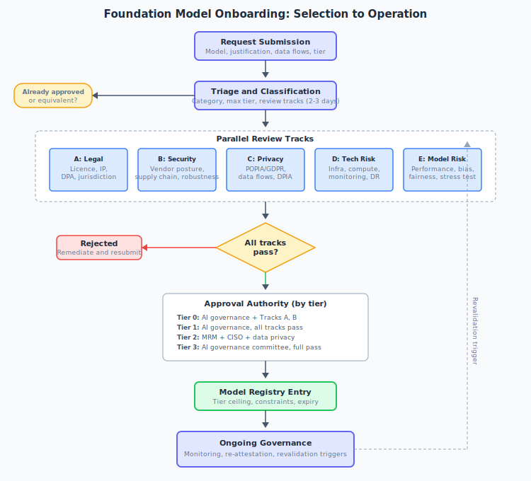
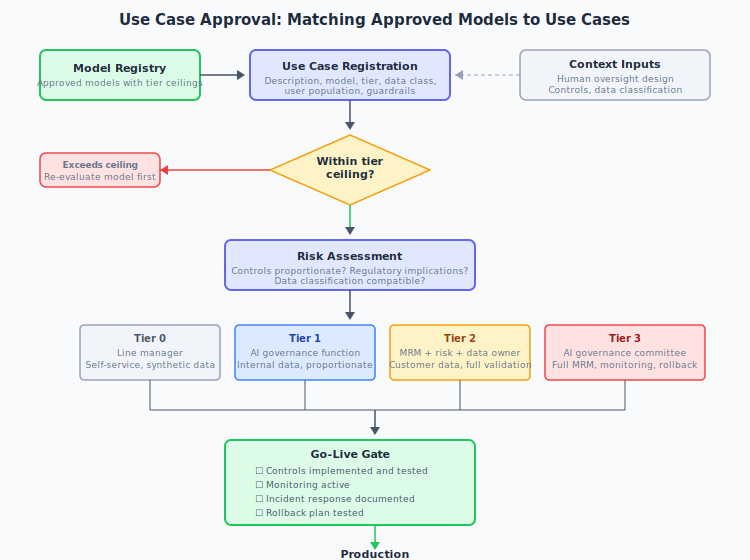
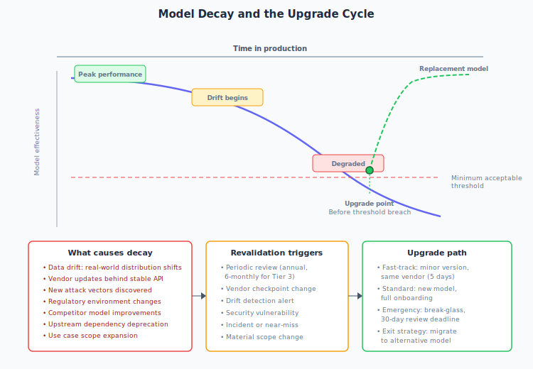

# Foundation Model Access

Before a foundation model reaches your ML pipeline, someone has to decide whether it should be there at all. Foundation models, including large language models, small language models, reasoning models, multi-modal models, embedding models, and agentic orchestration frameworks, introduce risk profiles that traditional software procurement does not cover. A model downloaded from a public repository can execute arbitrary code on load. A vendor API can change its behaviour without notice. A platform-embedded model can process sensitive data before anyone realises it is active.

This page covers the governance structure for accessing, downloading, deploying, and using foundation models. The goal is to balance responsible innovation with effective management of model risk, information security risk, data privacy risk, and operational risk.

!!! abstract "Where this fits"
    Foundation model access governance operates within and supplements your existing Model Risk Management (MRM) framework, information security policies, and data privacy standards. Where foundation models are used within applications already subject to MRM validation, this defines the additional requirements specific to foundation model characteristics.

## Sourcing categories

All foundation models must be classified into one of four sourcing categories. The risk profile differs materially between them.

| Category | Description | Primary risk surface |
|----------|-------------|---------------------|
| **Managed API** | Vendor-hosted model accessed via API (e.g., OpenAI, Anthropic, Google) | Data flow, vendor risk, concentration risk |
| **Platform-embedded** | Models integrated into enterprise tools (e.g., Copilot in M365, Gemini in Workspace) | Shadow usage, data leakage, feature creep |
| **Self-hosted commercial** | Licensed weights deployed on organisation infrastructure or private cloud | Compute governance, operational overhead, patching |
| **Open-weight download** | Models from public repositories (e.g., Hugging Face) pulled and run internally | Supply chain integrity, licensing ambiguity, provenance |

Each category carries distinct risks that require different controls. A managed API introduces vendor dependency and data flow concerns. An open-weight download introduces supply chain risks that are absent when the vendor hosts everything. Classifying the sourcing model early ensures the right review tracks are triggered.

## Risk tiering

Every model and use case is assigned to a risk tier that determines the depth of evaluation, the approval authority, and the ongoing monitoring requirements. The tiered model is designed to make the safe path the easy path: lightweight for experimentation, rigorous for customer impact.

| Tier | Description | Data permitted | Approval authority | Target SLA |
|------|-------------|----------------|-------------------|------------|
| **0: Sandbox** | Experimentation and prototyping | Synthetic or public data only | Team lead + security review | 5 working days |
| **1: Internal** | Internal productivity, human-in-the-loop | Internal (non-customer) data | AI governance function | 10 to 15 working days |
| **2: Business** | Business process integration | Customer data with controls | MRM + CISO + data privacy | 20 to 30 working days |
| **3: Customer** | Customer-facing or decision-influencing | All data classes with full controls | AI governance committee | As required |

!!! tip "Make the safe path the easy path"
    If your process makes it harder to use an approved API model than to download something off a public repository onto a laptop, people will choose the latter. Tier 0 sandbox access must be genuinely accessible. Overly burdensome processes for low-risk experimentation drive shadow AI adoption.

## Minimum requirements for model access

The following requirements apply to every foundation model regardless of sourcing category or intended tier.

### Provenance and identity

- The model must originate from an identifiable publisher with a verifiable organisational identity. Anonymous or pseudonymous model uploads on public repositories do not satisfy this requirement.
- The model version must be pinnable to a specific checkpoint. You must be able to determine exactly which version is running and detect if it changes.
- A model card or equivalent documentation must exist, covering intended use, known limitations, training data summary, and published evaluation results.

### Licensing and legal

- The model must have a clear commercial licence permitting use in your sector. Licence restrictions on sectors, use cases, or commercial application must be identified and assessed.
- The intellectual property indemnification position must be documented. Where the vendor does not provide IP indemnification, the residual risk must be formally accepted.
- Licence terms must not grant the model provider rights over your input or output data.

### Data residency and flow

- For API-accessed models, the data processing location must be contractually specified and compatible with applicable data protection regulations (POPIA, GDPR, DORA, or your local equivalent).
- The vendor must contractually confirm that customer inputs are not used for model training unless explicitly opted in through your data governance process.
- For downloaded models, training data provenance must be assessed for exposure to sanctioned entity data or unlawfully obtained personal information.

### Security baseline

- **API models:** the vendor must demonstrate authentication mechanisms, encryption in transit (TLS 1.2 or higher), encryption at rest for stored data, and SOC 2 Type II certification or equivalent assurance.
- **Downloaded models:** cryptographic hash verification of model weights against publisher-provided checksums is mandatory. Models without verifiable checksums are not permitted. See the [pickle deserialization risks](threat-intelligence.md#pickle-deserialization-attacks) documented in the threat intelligence page.
- The vendor or publisher must maintain a vulnerability disclosure process.

## Additional requirements by sourcing category

### API access

- Contractual terms must be reviewed by legal and procurement, covering SLA commitments, data processing agreements, breach notification obligations, and audit rights or equivalent assurance.
- The vendor must provide a mechanism to detect model version changes, including deprecation notices, changelogs, or version pinning capabilities within the API.
- Rate limiting and cost controls must be implementable to prevent runaway spend or abuse.
- Egress controls must enforce data classification policies on information flowing to the API endpoint, via DLP integration or proxy-layer classification.

### Downloaded and self-hosted models

**Supply chain integrity:**

- Models may only be downloaded from approved source registries (e.g., Hugging Face with verified publisher status, or directly from the vendor). Unverified sources are prohibited.
- Model weights must be scanned for known serialisation exploits. **Safetensors** format is preferred over raw pickle serialisation due to known [deserialisation attack vectors](threat-intelligence.md#pickle-deserialization-attacks).
- Downloaded artefacts must be placed into a quarantine or staging environment before promotion to any environment with access to organisation data.

**Compute and infrastructure governance:**

- Downloaded models must run within the approved compute environment with appropriate network segmentation, access controls, and logging. See [Secure ML Pipelines](secure-ml-pipelines.md) for pipeline-level controls.
- GPU and compute provisioning for model hosting must go through an approved procurement and provisioning process. Shadow compute provisioning is not permitted.

## Model evaluation framework

Before a model enters the approved registry, it must be evaluated across multiple dimensions. The depth of evaluation is calibrated to the requested tier.

### Performance and reliability

- Benchmark performance must be assessed on **domain-specific tasks** representative of the intended use cases, not solely on general-purpose benchmarks.
- Output consistency must be measured by executing identical prompts repeatedly and quantifying variance. For reasoning models, chain-of-thought faithfulness must be evaluated to determine whether stated reasoning drives the output.
- Degradation behaviour must be characterised: the model should fail gracefully with uncertainty signals rather than producing confident but incorrect outputs.

### Explainability and interpretability

- Define what constitutes sufficient explainability for each risk tier. For low-risk summarisation, provenance tracing may suffice. For credit, conduct, or customer-facing decisions, robust attribution chains with human review gates are required.
- For reasoning models that expose chain-of-thought traces, the faithfulness of the reasoning trace to the actual computation must be assessed.

### Bias, fairness, and conduct risk

- Protected characteristic testing must cover all relevant demographics under applicable law.
- Sycophancy and anchoring bias must be tested, particularly for models in advisory or decision-support roles.
- Both **allocative harm** (impacts on credit, pricing, or resource allocation) and **representational harm** (inappropriate or biased language) must be assessed.

### Security and adversarial robustness

- Prompt injection resilience must be tested, covering both direct injection and indirect injection via untrusted content in context.
- Jailbreak resistance must be evaluated, and the vendor's patch cadence for newly discovered attack vectors must be documented.
- Model supply chain integrity must be verifiable: you must be able to confirm that the model in production is the model that was evaluated.
- For agentic or tool-calling configurations, the blast radius of a compromised or manipulated model must be assessed and bounded.

### Operational risk

- Vendor lock-in and concentration risk must be documented, including the impact of vendor pricing changes, model deprecation, or service discontinuation.
- Model drift through vendor-initiated updates must be detectable. Where the vendor updates model weights behind a stable API version, you must have mechanisms to identify performance changes.
- Latency, throughput, and availability SLAs must be assessed relative to the criticality of the dependent business process.
- An exit strategy must exist: you must be able to migrate to an alternative model without rebuilding the entire application.

## Approval process

The approval process consists of two distinct but linked procedures: **model onboarding** (getting a model into the approved registry) and **use case approval** (getting permission to use an approved model for a specific purpose). Decoupling these prevents redundant evaluation of models already in the registry.

{ .arch-diagram }

### Model onboarding

#### Step 1: Request submission

Any employee should be able to submit a model onboarding request. Restricting intake is counterproductive and drives shadow AI adoption. The request must contain:

- Model name, version, publisher, and sourcing category
- Business justification, including why an already-approved alternative is insufficient
- Licence terms summary
- Data flow description (data sent, data returned, data retained)
- Intended maximum tier

#### Step 2: Triage and classification

The AI governance function performs a rapid triage assessment with a target turnaround of two to three working days. The triage determines:

- Whether the model is already onboarded or substantially equivalent to an approved model
- The applicable sourcing category
- The maximum permissible tier based on initial risk characteristics
- Which parallel review tracks are required

The output is a classification decision and a tailored review checklist. Not every model requires every review track.

#### Step 3: Parallel review tracks

All applicable review tracks run concurrently. Sequential review is the single greatest process bottleneck and must be avoided.

| Track | Owner | Key assessments |
|-------|-------|-----------------|
| **A: Legal and licensing** | Legal, procurement | Licence compatibility, IP indemnification, DPA, jurisdiction |
| **B: Information security** | CISO function | Vendor security posture, encryption, supply chain integrity, adversarial robustness |
| **C: Data privacy** | DPO, privacy | Regulatory compliance, data flows, DPIA requirement, training opt-out |
| **D: Technology risk** | Enterprise architecture | Infrastructure, integration, compute, monitoring, DR/BCP |
| **E: Model risk** | MRM function | Performance, bias, fairness, explainability, stress testing (depth per tier) |

Each track produces a **pass**, **conditional pass**, or **fail** outcome with documented rationale.

#### Step 4: Approval decision

The approval authority depends on the requested tier:

- **Tier 0 (Sandbox):** AI governance function approves directly, provided Tracks A and B pass.
- **Tier 1 (Internal):** AI governance function approves; all tracks must pass or conditionally pass.
- **Tier 2 (Business):** Requires sign-off from MRM, CISO, and data privacy. Conditional passes escalate to the AI governance committee.
- **Tier 3 (Customer):** AI governance committee approval required. All tracks must fully pass. No target SLA is imposed to avoid incentivising premature approval.

#### Step 5: Registry entry

Approved models are entered into the central [model registry](model-lifecycle.md#registration) with the following attributes:

- Approved tier ceiling (the maximum tier at which any use case may operate without model re-evaluation)
- Conditions and constraints (e.g., data restrictions, mandatory guardrail requirements)
- Approved deployment patterns
- Expiry and re-attestation date (maximum 12 months; 6 months for Tier 3)
- Assigned owner responsible for ongoing vendor and publisher monitoring

### Use case approval

{ .arch-diagram }

#### Step 1: Use case registration

The requestor submits a use case registration containing:

- Use case description and intended business outcome
- Approved model(s) from the registry
- Requested tier (must not exceed the model's approved tier ceiling)
- Data classification of inputs and outputs
- User population (internal, external, autonomous)
- Human oversight design, specifying decision points where a human intervenes
- Guardrails and controls to be implemented

#### Step 2: Risk assessment

The AI governance function assesses:

- Whether the use case falls within the model's approved tier and conditions
- Whether the proposed controls are proportionate to the risk
- Whether regulatory implications exist specific to this use case
- Whether the data classification is compatible with the model's approved data flow

#### Step 3: Approval

| Tier | Approval authority | Key requirements |
|------|--------------------|------------------|
| **Tier 0** | Requestor's line manager | Self-service with registration; synthetic data only |
| **Tier 1** | AI governance function | Controls proportionate to risk; internal data |
| **Tier 2** | MRM + business risk owner + data owner | Full control validation; customer data with safeguards |
| **Tier 3** | AI governance committee (MRM, CISO, compliance, business exec) | Full MRM validation; monitoring active; rollback plan |

#### Step 4: Go-live gate

Before production deployment, the following must be confirmed:

- [ ] All approved controls are implemented and tested
- [ ] Monitoring is active and generating alerts
- [ ] Incident response and escalation path is documented
- [ ] A rollback plan exists and has been tested
- [ ] Users and operators have been trained on model limitations and escalation triggers

## Process safeguards

### Escalation and override

- Any review track may escalate to the AI governance committee if a risk is identified that crosses tier boundaries.
- The CRO (or equivalent) has override authority for exceptional business need. Overrides must be logged, time-limited, and reported to the board risk committee.

### Fast-track for equivalent models

Where a model is substantially equivalent to an already-approved model (e.g., a minor version update from the same vendor with no architectural change), an expedited re-certification path should be available. Security and legal confirm no material change; MRM confirms performance is not degraded. Target turnaround: five working days.

### Emergency access

A break-glass process should exist for genuine emergencies where a model must be deployed before full approval completes:

- Requires joint authorisation from the CISO and CRO
- Full review must be completed within 30 calendar days
- Automatic shutdown is triggered if the review is not completed within the deadline

!!! warning "Emergency access is not a shortcut"
    The break-glass process exists for genuine emergencies, not for bypassing inconvenient timelines. Every use of emergency access should be reviewed retrospectively to determine whether the process itself needs adjustment.

### Prohibited models

The following models are prohibited from access or download under any circumstances:

- Models from sanctioned entities or jurisdictions
- Models with no identifiable provenance
- Models whose licence explicitly prohibits use in your sector
- Models known to have been trained on data obtained through unlawful means, where this is established rather than speculative
- Models requiring network egress for telemetry purposes unless the telemetry is contractually governed and approved

## Ongoing governance and monitoring

{ .arch-diagram }

### Model registry

The central model registry is the authoritative record of all approved models. If a model is not in the registry, it is not permitted for use on organisation systems. The registry must be accessible to all employees for self-service visibility to reduce redundant onboarding requests. See [Model Lifecycle: Registration](model-lifecycle.md#registration) for the registry's technical attributes.

### Continuous monitoring

All models approved at Tier 1 and above must be subject to ongoing monitoring:

- Output quality metrics appropriate to the use case
- Drift detection for performance degradation
- Abuse pattern detection
- Cost and usage monitoring
- Vendor and publisher advisories (security, licensing, deprecation)

For runtime monitoring controls, see [AI Runtime Security](https://airuntimesecurity.io/).

### Periodic review

- All approved models must be re-attested at least annually.
- All Tier 2 and Tier 3 use cases must be reviewed at least annually, or upon material change to the use case, model, or regulatory environment.
- The registry owner publishes a quarterly report to the AI governance committee covering models approved, rejected, suspended, in pipeline, and any incidents.

### Revalidation triggers

Outside of periodic review, revalidation of a model or use case is triggered by:

- Vendor-initiated model updates or checkpoint changes
- Disclosure of new attack vectors or security vulnerabilities
- Regulatory changes affecting the use case or data flow
- Material changes to the use case scope, user population, or data classification
- Incidents or near-misses involving the model

## Design principles

These principles guide interpretation where specific requirements are ambiguous.

| Principle | Rationale |
|-----------|-----------|
| **Make the safe path the easy path** | If the approved route is harder than the unofficial one, people will go unofficial. Tier 0 must be genuinely accessible |
| **Decouple model onboarding from use case approval** | Evaluate the model once; approve use cases against it. Redundant evaluation creates bottlenecks that drive non-compliance |
| **Run review tracks in parallel** | Sequential review is the single greatest predictor of process abandonment. All applicable tracks start simultaneously from triage |
| **Calibrate depth to risk** | A sandbox experiment with synthetic data does not need the same scrutiny as a customer-facing credit decisioning tool |
| **Maintain a central registry with self-service visibility** | Transparency about what is already approved reduces redundant requests and shadow AI adoption |
| **Plan for exit** | Vendor concentration and lock-in are real risks in a rapidly evolving market. Every approved model should have a documented exit strategy |

!!! info "References"
    - [NIST AI Risk Management Framework](https://www.nist.gov/itl/ai-risk-management-framework)
    - [EU AI Act](https://artificialintelligenceact.eu/)
    - [OWASP Top 10 for LLM Applications](https://genai.owasp.org/)
    - [MITRE ATLAS](https://atlas.mitre.org/)
    - [Hugging Face: Model Cards](https://huggingface.co/docs/hub/model-cards)
    - [Safetensors: Safe Serialization](https://huggingface.co/docs/safetensors/)
    - [SLSA: Supply-chain Levels for Software Artifacts](https://slsa.dev/)
    - [AI Runtime Security](https://airuntimesecurity.io/)
