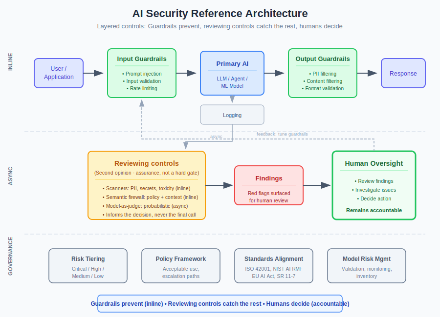

# Controls

This is where you choose the controls. Once you have [threat modelled](../threat-modelling.md) the system and sized its [risk tier](risk-tiers.md), this section gives you the control set to apply: the three-layer pattern, agentic and IAM controls, the reviewing layer (scanners, semantic firewall, model-as-judge), and the specialised controls particular deployments need. Select what fits the risk, adapt it to how your organisation works, and consciously deselect the rest.

!!! info "Canonical home: airuntimesecurity.io"
    The runtime control definitions are maintained in depth on [AI Runtime Security](https://airuntimesecurity.io/core/). These pages mirror that material so an architect can design the control set here and hand off to AIRS for runtime operation. Where the two differ, airuntimesecurity.io is authoritative.

## Reading Order

Start with the essentials, then branch into specialised topics based on your deployment:

**Essential (read in order):**
1. [Risk Tiers](risk-tiers.md) - classify your system
2. [Risk Assessment](risk-assessment.md) - quantify control effectiveness and residual risk per tier
3. [Controls](controls.md) - implement the three-layer pattern
4. [Agentic](agentic.md) - add controls if your agent has tool access
5. [IAM Governance](iam-governance.md) - identity, lifecycle, delegation
6. [Judge Assurance](judge-assurance.md) - measure and calibrate the model-as-judge within the reviewing layer
7. [Checklist](checklist.md) - track implementation progress

**Specialised (read based on your deployment type):**

| If you're deploying... | Read |
|---|---|
| Multimodal models (image, audio, video) | [Multimodal Controls](multimodal-controls.md) |
| Reasoning models (chain-of-thought) | [Reasoning Model Controls](reasoning-model-controls.md) |
| Streaming responses | [Streaming Controls](streaming-controls.md) |
| Persistent memory or long context | [Memory and Context](memory-and-context.md) |
| Multi-agent systems | [Multi-Agent Controls](multi-agent-controls.md) then [MASO](https://airuntimesecurity.io/maso/) |
| Open-weight / self-hosted models | [Open-Weight Models Shift the Burden](https://airuntimesecurity.io/insights/open-weight-models-shift-the-burden/) |

**PACE resilience (read after controls):**
- [Control Layer Resilience](pace-controls-section.md) - PACE for each control layer
- [PACE for Agentic AI](pace-agentic-section.md) - PACE for agentic deployments
- [PACE Checklist](pace-checklist-section.md) - verify your fail postures

## The Fundamental Shift

Traditional software can be tested before deployment. AI cannot - not fully.

| Traditional Software | AI Systems |
|---------------------|------------|
| Deterministic outputs | Non-deterministic |
| Testable at design time | Emergent behavior |
| Known failure modes | Adversarial discovery |

**The shift:** From design-time assurance to runtime behavioral monitoring.

## The Pattern

The industry is converging on three layers:

| Layer | Function | Timing |
|-------|----------|--------|
| **Guardrails** | Block known-bad inputs/outputs deterministically | Real-time |
| **Reviewing controls** | Second opinion on unknown-bad: scanners, semantic firewall, model-as-judge | Inline and async |
| **Human Oversight** | Decide, act, remain accountable | As needed |

**Guardrails prevent. Reviewing controls catch what they miss. Humans decide.** The judge within the reviewing layer informs the decision; it never replaces the deterministic guardrails beneath it.

### Where This Pattern Exists

This isn't theoretical. Production implementations include:

| Platform | Implementation |
|----------|----------------|
| [NVIDIA NeMo Guardrails](https://github.com/NVIDIA/NeMo-Guardrails) | Input, dialog, retrieval, execution, output rails |
| [LangChain](https://docs.langchain.com/) | Middleware + human-in-the-loop |
| [Guardrails AI](https://www.guardrailsai.com/) | Open-source validator framework |
| [Galileo](https://www.rungalileo.io/) | Eval-to-guardrail lifecycle |
| [DeepEval](https://github.com/confident-ai/deepeval) | Model-as-Judge evaluation |
| AWS Bedrock Guardrails | Managed filtering |
| Azure AI Content Safety | Content moderation |

What has been missing: clear guidance on *why* this pattern is necessary and *how* to implement it proportionate to risk, in a way that respects how each organisation actually works.

## Scope

**In:** Custom LLM apps, AI decision support, document processing, agentic systems  
**Out:** Vendor AI products, model training, data preparation

## Quick Start

### 1. Classify Your System

| Tier | Profile | Examples |
|------|---------|----------|
| **CRITICAL** | Direct decisions, customer/financial/safety impact | Credit decisions, fraud blocking |
| **HIGH** | Significant influence, sensitive data | Customer service with account access |
| **MEDIUM** | Moderate impact, human review expected | Internal Q&A, document drafting |
| **LOW** | Minimal impact, non-sensitive | Public FAQ, suggestions |

### 2. Select Controls

| Control | LOW | MEDIUM | HIGH | CRITICAL |
|---------|-----|--------|------|----------|
| Input guardrails | Basic | Standard | Enhanced | Maximum |
| Output guardrails | Basic | Standard | Enhanced | Maximum |
| Reviewing controls | Scanners | Scanners + sampled judge | + Semantic firewall, inline judge | Full layer, inline on high-impact |
| Human review | Exceptions | Sampling | Risk-based | All significant |

### 3. Implement in Order

1. **Logging** - Can't evaluate what you don't capture
2. **Basic guardrails** - Block obvious attacks  
3. **Reviewing controls in shadow mode** - Scan and evaluate without action
4. **HITL queues** - Somewhere for findings to go
5. **Operationalise** - Act on findings, tune continuously

## Core Documents

| Document | Purpose |
|----------|---------|
| [Risk Tiers](risk-tiers.md) | Classification criteria, control mapping |
| [Risk Assessment](risk-assessment.md) | Quantitative control effectiveness, residual risk analysis, worked examples per tier |
| [Controls](controls.md) | Guardrails, reviewing controls, HITL implementation |
| [Agentic](agentic.md) | Additional controls for agents |
| [IAM Governance](iam-governance.md) | Identity governance, agent lifecycle, delegation, threats |
| [Checklist](checklist.md) | Implementation tracking |
| [Emerging Controls](emerging-controls.md) | Multimodal, reasoning, streaming overview |

### Specialized Controls

| Document | Purpose |
|----------|---------|
| [Judge Assurance](judge-assurance.md) | Judge accuracy measurement and calibration |
| [Multi-Agent Controls](multi-agent-controls.md) | Controls for multi-agent systems |
| [Multimodal Controls](multimodal-controls.md) | Controls for image, audio, and video AI |
| [Memory and Context](memory-and-context.md) | Long context and persistent memory controls |
| [Reasoning Model Controls](reasoning-model-controls.md) | Controls for chain-of-thought reasoning models |
| [Streaming Controls](streaming-controls.md) | Controls for real-time streaming outputs |

### PACE Sections

| Document | Purpose |
|----------|---------|
| [PACE Controls Section](pace-controls-section.md) | PACE framework - controls |
| [PACE Agentic Section](pace-agentic-section.md) | PACE framework - agentic controls |
| [PACE Checklist Section](pace-checklist-section.md) | PACE framework - implementation checklist |

### Architecture Overview

{ .arch-diagram }

## Key Principles

1. **Match controls to risk** - Apply the right controls at the right time for the right purposes. Do not over-engineer low-risk systems
2. **Respect organisational context** - Every organisation has its own structures and ways of working. Select and adapt controls accordingly
3. **Guardrails are necessary but not sufficient** - They miss novel attacks and nuance
4. **The reviewing layer is assurance, not a hard gate** - Scanners and the semantic firewall add deterministic and semantic checks; the model-as-judge informs the decision but is probabilistic and can be fooled, so it never replaces the deterministic guardrails beneath it
5. **Infrastructure beats instructions** - Enforce technically, not via prompts
6. **Assume bypasses happen** - Design for detection, not just prevention
7. **Humans remain accountable** - AI assists; humans own outcomes

