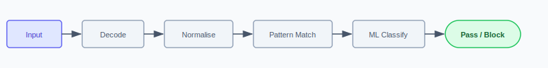
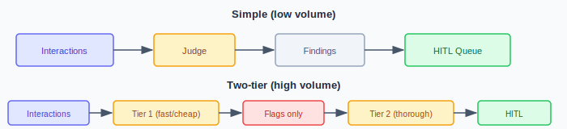
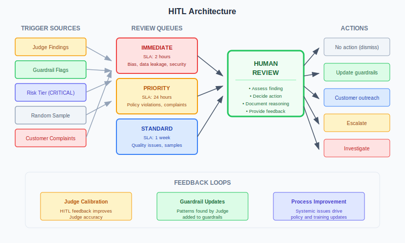

# Controls: Guardrails, Reviewing Controls, and Human Oversight

## 1. Guardrails

Real-time controls that block known-bad inputs and outputs.

### Input Guardrails

| Control | What It Catches |
|---------|-----------------|
| **Injection detection** | Attempts to override system prompt |
| **Encoding detection** | Obfuscated attacks (Base64, hex, Unicode) |
| **PII detection** | Personal data in prompts |
| **Content policy** | Prohibited request types |
| **Rate limiting** | Abuse, enumeration |
| **Length limits** | Context stuffing |

**Processing flow:**

{ .arch-diagram }

### Output Guardrails

| Control | What It Catches |
|---------|-----------------|
| **Content filtering** | Harmful/inappropriate content |
| **PII detection** | Personal data leakage |
| **Grounding check** | Hallucination |
| **Format validation** | Malformed responses |

### Limitations

Guardrails catch **known patterns**. They miss:
- Novel techniques
- Semantic variations
- Context-dependent violations
- Subtle policy violations

This is why **reviewing controls** add a second layer.

!!! info "See also"
    For practical implementation guidance, including international PII detection, RAG ingestion filtering, secrets scanning, alerting design, and guardrail exception governance, see **Practical Guardrails**.

## 2. Reviewing controls

A second opinion before anything reaches the user: **scanners**, a **semantic firewall**, and a **model-as-judge** weighing the response against policy, context, and intent. This is what catches the subtle failures a fixed rule waves straight through.

The judge is itself a model, so it is probabilistic and can be fooled. It **informs the decision rather than making the final call**, and it never stands in for the deterministic guardrails beneath it. Treat the reviewing layer as assurance that raises confidence, not as a hard gate your safety case can rest on.

| Component | What it does | Determinism | Typical placement |
|-----------|--------------|-------------|-------------------|
| **Scanners** | Signature and classifier checks over the response: PII, secrets, toxicity, known-bad patterns | Mostly deterministic | Inline, low latency |
| **Semantic firewall** | Weighs the response against policy and context, catching semantic violations a regex waves through | Mixed | Inline, low to moderate latency |
| **Model-as-judge** | An LLM or distilled SLM weighing the response against policy, context, and intent | Probabilistic | SLM inline (~50ms); LLM async |

!!! info "On the runtime side"
    - [Inside the semantic firewall](https://airuntimesecurity.io/core/semantic-firewall/)
    - [When the judge can be fooled](https://airuntimesecurity.io/core/when-the-judge-can-be-fooled/)

### Choosing reviewing controls: risk, latency, and PACE

Match the reviewing layer to the risk it guards, the latency the interaction can spend, and the [PACE](pace-controls-section.md) posture you fall back to when part of the layer is degraded.

| Risk tier | Reviewing layer | Latency posture | PACE fallback |
|-----------|-----------------|-----------------|---------------|
| **LOW** | Output scanners | Inline, negligible | Primary scanners; if down, log and serve |
| **MEDIUM** | Scanners plus a sampled async judge | Inline scan; judge off the hot path | Drop to scanners only; sample later |
| **HIGH** | Scanners plus semantic firewall, inline SLM judge, async LLM audit | SLM under ~50ms inline; LLM async | Alternate to scanners plus firewall; deterministic block on high-impact actions |
| **CRITICAL** | Full reviewing layer inline on high-impact actions, plus human oversight | Inline within the action's budget | Emergency: deny the action, route to a human |

The judge informs; it does not hold the line alone. Where latency forbids an inline judge, keep deterministic scanners and the semantic firewall in the hot path and run the judge asynchronously. The [control matrix](risk-tiers.md#control-matrix) gives baseline depth per tier.

### The model-as-judge

Evaluation of interactions for quality and policy compliance. The judge can be a large LLM (for async assurance and complex reasoning) or a distilled SLM (for inline, real-time action screening). Both can be combined: an SLM screens every action in under 50ms while a large LLM audits a sample asynchronously.

!!! info "See also"
    For model selection guidance, see Judge Model Selection.

#### What the judge does

| Function | Description |
|----------|-------------|
| Policy compliance | Did the AI follow guidelines? |
| Quality assessment | Accurate, helpful, appropriate? |
| Anomaly detection | Unusual patterns? |
| Risk flagging | What needs human review? |

#### What the judge does NOT do

- Block transactions in real-time
- Make final decisions
- Replace human judgment
- Replace the deterministic guardrails beneath it

**The judge surfaces findings and informs the decision. Deterministic controls hold the line, and humans decide actions.**

#### Architecture

{ .arch-diagram }

#### Evaluation criteria

| Criterion | Scoring |
|-----------|---------|
| Policy adherence | Pass / Minor / Major violation |
| Accuracy | Verified / Unverified / Incorrect |
| Appropriateness | Appropriate / Borderline / Inappropriate |
| Safety | Safe / Uncertain / Concerning |

**Output:** PASS / REVIEW / ESCALATE

#### Deployment phases

| Phase | Action on Findings |
|-------|-------------------|
| **Shadow** | Log only, measure accuracy |
| **Advisory** | Surface to humans, learn from feedback |
| **Operational** | Findings drive workflows |

**Start in shadow mode.** Validate accuracy before acting.

#### Accuracy

The judge will make mistakes.

| Error | Impact | Mitigation |
|-------|--------|------------|
| False positive | Unnecessary review | Tune prompts |
| False negative | Missed violations | Human sampling |

**Target:** >90% agreement with human reviewers.

## 3. Human Oversight (HITL)

Humans review findings, make decisions, remain accountable.

{ .arch-diagram }

### Triggers

| Trigger | Response |
|---------|----------|
| Judge flag | Review interaction |
| Guardrail block | Review if legitimate |
| User escalation | Human takes over |
| Sampling | Quality assurance |
| Threshold breach | Investigate pattern |

### Queue Design

| Queue | SLA | Reviewer |
|-------|-----|----------|
| Critical | 1h | Senior + expert |
| High | 4h | Domain expert |
| Standard | 24h | Trained reviewer |
| Sampling | 72h | QA team |

### Actions

| Action | When |
|--------|------|
| Approve | Interaction appropriate |
| Correct | Minor issue, fixable |
| Escalate | Needs senior review |
| Block user | Abuse detected |
| Tune | False positive |

### Prevent Rubber-Stamping

| Control | Purpose |
|---------|---------|
| Canary cases | Verify reviewers catch known-bad |
| Time tracking | Flag too-fast reviews |
| Volume limits | Prevent fatigue |
| Inter-rater checks | Measure consistency |

## Going Deeper

| Topic | Document |
|-------|----------|
| What these controls cost in production | Cost & Latency - latency budgets, sampling strategies, tiered evaluation cascade |
| Judge accuracy, drift, and adversarial failure | [Judge Assurance](judge-assurance.md) · [When the Judge Can Be Fooled](https://airuntimesecurity.io/core/when-the-judge-can-be-fooled/) |
| Practical guardrail configurations | Practical Guardrails - what to turn on first, encoding detection, international PII |
| When HITL doesn't scale | Humans in the Business Process - using existing business process checkpoints as a detection layer |
| Controls for multi-agent systems | MASO Framework - 128 controls across 7 domains for agent orchestration |
| Controls for reasoning models (o1, etc.) | [Reasoning Model Controls](reasoning-model-controls.md) - trace scanning, instruction adherence, consistency checks |
| Session-level and pre-action evaluation | Output Evaluator - session-aware, pre-action evaluation architecture for agentic systems |

## Implementation Order

1. **Logging** - Can't evaluate what you don't capture
2. **Basic guardrails** - Block obvious attacks
3. **Reviewing controls in shadow** - Scan and evaluate without action
4. **HITL queues** - Somewhere for findings
5. **Reviewing layer advisory** - Surface to humans
6. **Enhanced guardrails** - Add ML detection
7. **Reviewing layer operational** - Drive workflows
8. **Continuous tuning** - Improve from findings

