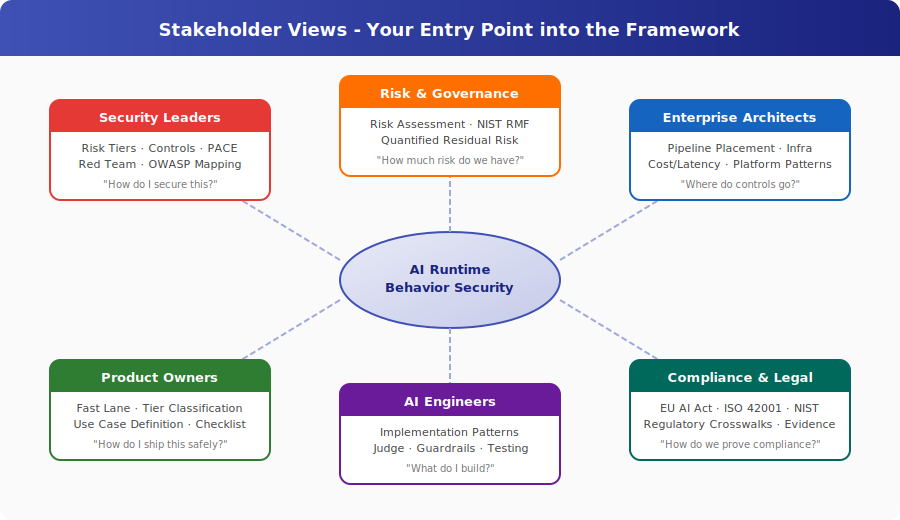

# Stakeholder Views

**Your role. Your risks. Your entry point.**

This framework covers a lot of ground. Nobody needs all of it. The framework is designed so that you can quickly identify the controls relevant to your role and context, apply the ones you need, and consciously deselect the ones you do not.

These pages tell you **what matters for your role**, **why you should care**, and **where to start reading**. Each one is a window from your perspective, not a summary of everything, but a filter for what is relevant to your work.

## Pick Your Role

| Role | Who It's For | Core Question |
|---|---|---|
| **[Security Leaders](security-leaders.md)** | CISOs, Security Directors, Security Architects | *How do I secure AI when the threat model is unlike anything I've secured before?* |
| **[Risk & Governance](risk-and-governance.md)** | CROs, Risk Managers, GRC Teams | *How do I quantify AI risk and prove to the board that controls are working?* |
| **[Enterprise Architects](enterprise-architects.md)** | Solution Architects, Platform Architects, Technical Leads | *Where do controls go in my pipeline, what do they cost, and how do they fail?* |
| **[Chief Information Officers](chief-information-officers.md)** | CIOs, CTOs, VP Technology | *How do I govern AI across my technology portfolio when every product runs different agents?* |
| **[Business Owners](business-owners.md)** | Business Unit Leaders, P&L Owners, General Managers | *How do I manage AI risk across my product lines when agents are operational and the cost is real?* |
| **[Product Owners](product-owners.md)** | Product Managers, Business Owners, Delivery Leads | *What controls are required to ship AI, and what do they cost in time and money?* |
| **[AI Engineers](ai-engineers.md)** | ML Engineers, AI Developers, Data Scientists, Platform Engineers | *What do I actually build? Give me implementation patterns, not governance theory.* |
| **[Compliance & Legal](compliance-and-legal.md)** | Compliance Officers, Legal Counsel, DPOs, Audit Teams | *How do I demonstrate that AI deployments meet regulatory obligations - with evidence?* |
| **[Insider Threat Teams](insider-threat-teams.md)** | Insider Risk Analysts, UEBA Engineers, Behavioral Analytics Teams | *Your programme already solves the problem AI agents create - how do you extend it?* |

## How These Pages Work

Each stakeholder page follows the same structure:

1. **The problem from your perspective** - why AI security isn't like the security you already know
2. **What this reference gives you** - the specific parts relevant to your work
3. **Your starting path** - ordered reading list, 3-5 documents deep
4. **What you can do Monday morning** - concrete first actions
5. **Common objections addressed** - the pushback you'll get, with answers

These are entry points, not destinations. Follow the links deeper when you need depth.

